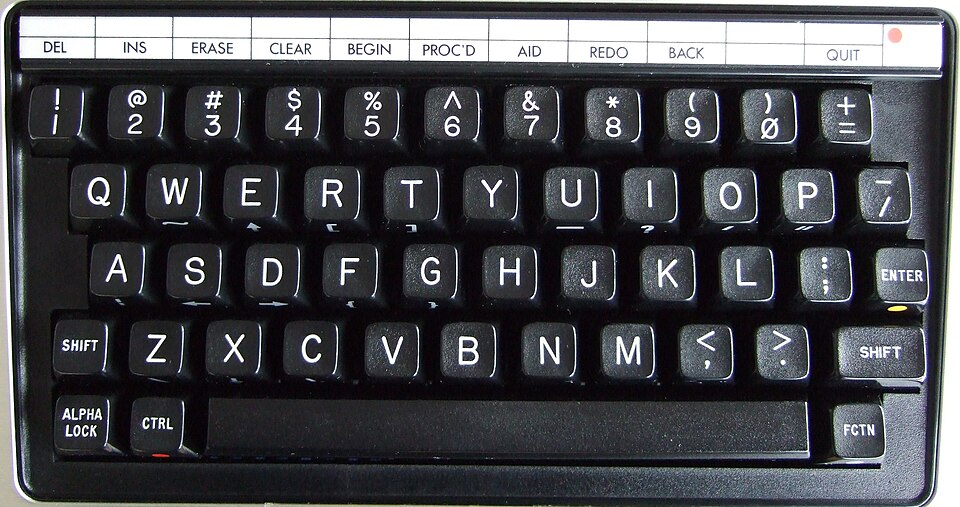
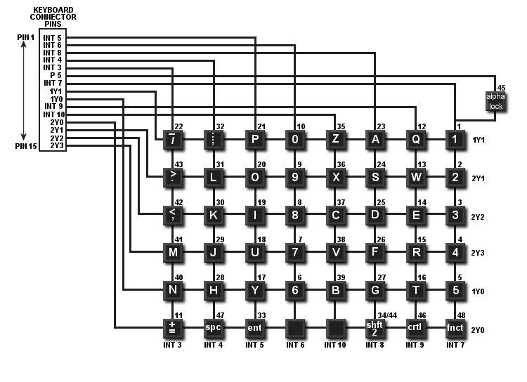

# TI-99/4A Keyboard USB HID Converter

This project allows for the keyboard for a TI-99/4A (I recommend the Alps model) to connect to a modern computer using a microcontroller running CircuitPython as a HID keyboard device. Useful when using an emulator.

## Dependencies

* [CircuitPython 9.2.8](https://circuitpython.org/)
* A microcontroller that can reliably run CircuitPython (I'm using a [RP2040](https://www.aliexpress.us/item/3256805941727857.html)).

## Schematic

### Keyboard Matrix

## What doesn't work?

* Special keys like __CTRL__, __FCTN__, __SHIFT__, __ALPHA LOCK__

## Wishlist

* Debouncing
* Layer support (needed for __FCTN__ key)
* Support multiple keypresses simultanously
* 3D model for enclosure
